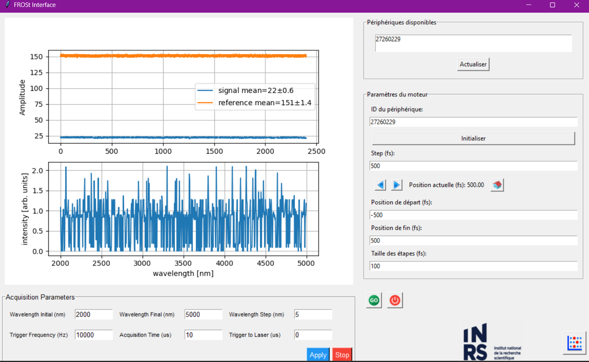

# Interface pour l'Acquisition de Traces FROSt

Ce projet fournit une interface graphique pour l'acquisition de traces FROSt, intégrant le contrôle du moteur KDC101 de Thorlabs et du spectromètre Mozza de Fastlite.

## Interface Finale

L'interface permet de contrôler le moteur et d'acquérir les spectres en synchronisation. Voici à quoi elle ressemble :



## Installation

Pour configurer et utiliser cette interface, suivez les étapes ci-dessous :

1. **Clonez le dépôt :**

   ```bash
   git clone https://github.com/Enzo77360/FROSt_Interface.git
   cd FROSt_Interface
   ```

2. **Créez un environnement virtuel (optionnel mais recommandé) :**

   ```bash
   python -m venv venv
   source venv/bin/activate  # Sur Windows, utilisez `venv\Scripts\activate`
   ```

3. **Installez les dépendances :**

   Assurez-vous que `pip` est à jour :

   ```bash
   pip install --upgrade pip
   ```

   Installez les packages requis :

   ```bash
   pip install -r requirements.txt
   ```

   Note : Vous devrez également installer les DLLs et bibliothèques spécifiques pour le moteur KDC101 et le spectromètre Mozza. Reportez-vous aux documents fournis par Thorlabs et Fastlite pour les instructions détaillées.

4. **Installez les bibliothèques supplémentaires :**

   Si vous avez besoin de la bibliothèque Mozza pour Python, vous pouvez l'installer via :

   ```bash
   pip install libmozza-1.0.2-py3-none-any.whl
   ```

   Assurez-vous que les DLLs de Thorlabs sont correctement placées dans votre système.

## Utilisation

1. **Démarrer l'interface :**

   Une fois toutes les dépendances installées, vous pouvez lancer l'interface graphique en exécutant :

   ```bash
   python MainWindow.py
   ```

2. **Configurer les équipements :**

   Avant de commencer, assurez-vous que le moteur KDC101 et le spectromètre Mozza sont correctement connectés à votre ordinateur et que les drivers nécessaires sont installés.

3. **Utiliser l'interface :**

   - **Contrôle du moteur :** Utilisez les contrôles fournis pour ajuster la position du moteur. Les mouvements sont synchronisés avec les acquisitions du spectromètre.
   - **Acquisition des spectres :** Configurez les paramètres d'acquisition et lancez les mesures via l'interface. Les spectres acquis seront affichés en temps réel.

4. **Sauvegarder les données :**

   Les données acquises seront automatiquement enregistrées dans des sous-dossiers organisés par date et heure de l'acquisition dans le répertoire `acquisitions`.

## Références

- [GitHub du Projet](https://github.com/Enzo77360/FROSt_Interface)


